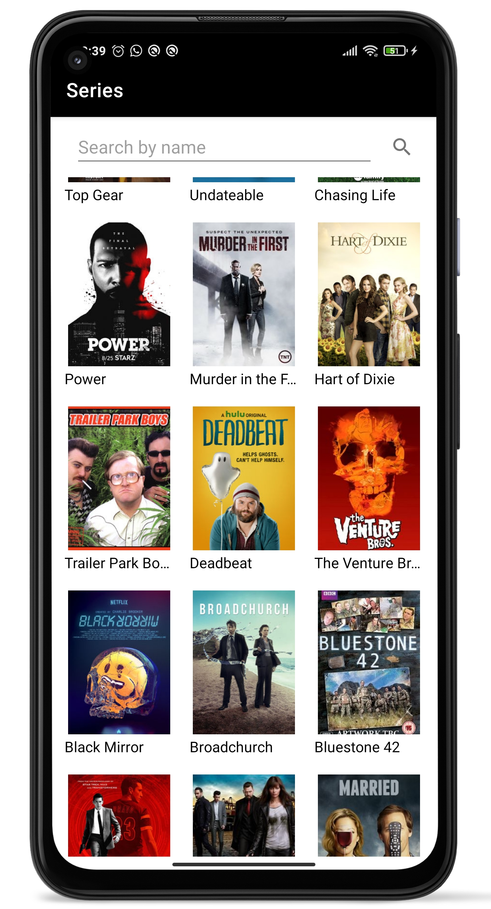
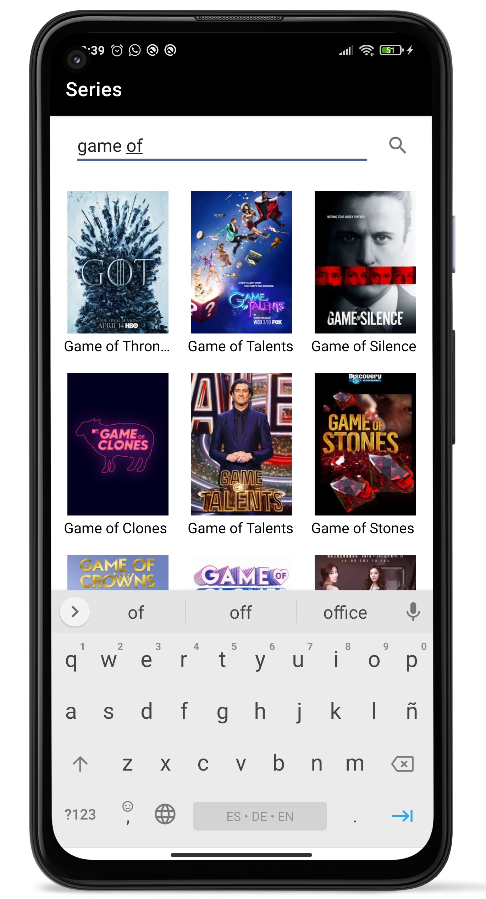
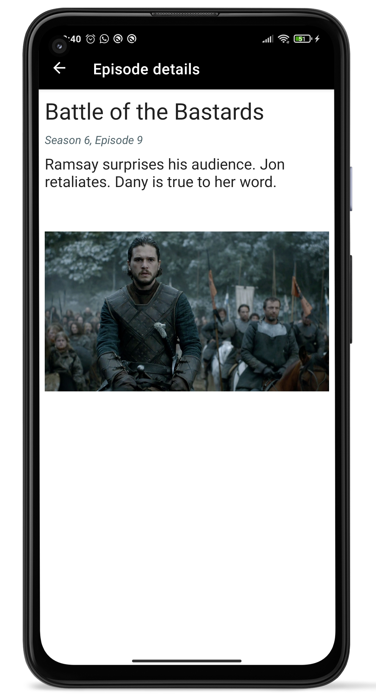
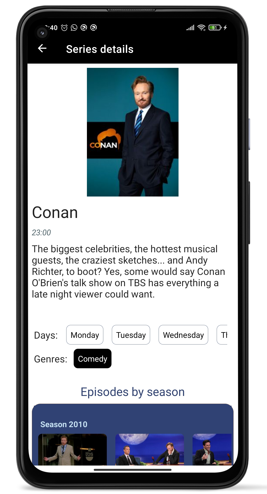
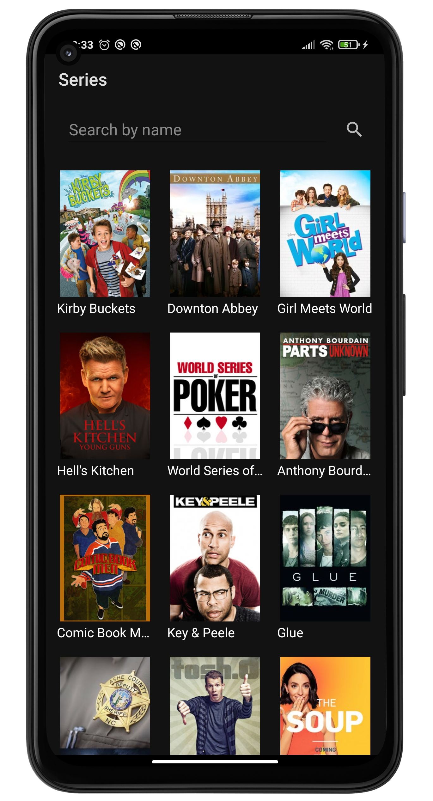
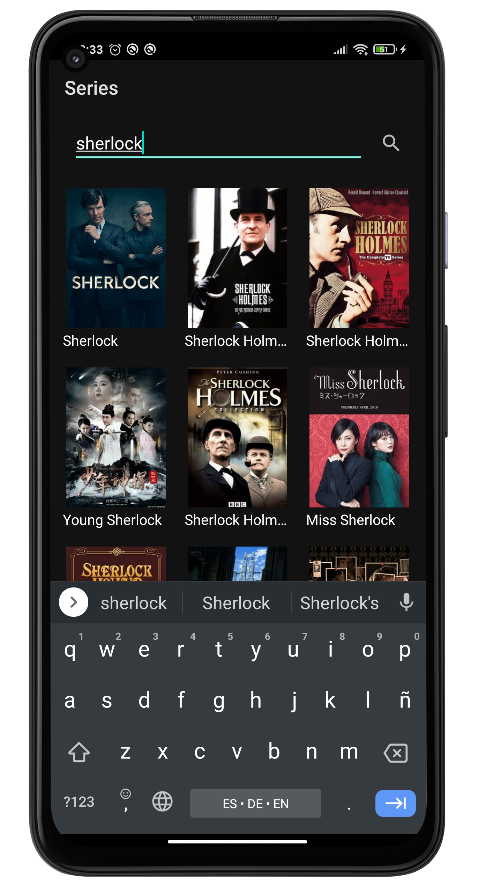
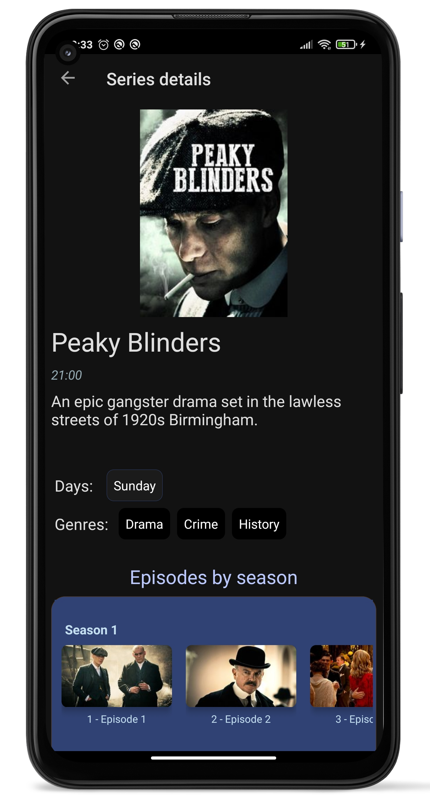
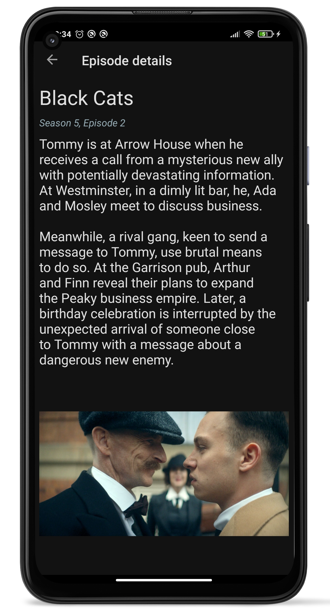

# TVMazeChallengeApp
Series browser with name, image, summary, seasons and episodes provided by an external API (TVMaze).    

## Features
★ This app is fully developed in Kotlin.    
★ Main page that shows a list of series.  
★ Shows can be queried by name.  
★ Each show is clickable and opens a second screen where the complete series information is
displayed: name, image, days, time, genres, summary and a list of episodes grouped by season.  
★ Each episode is clickable and opens another screen where the complete episode information is
displayed: name, image, number, season, and summary.  
★ The catalog is paged: when scrolling reaches the end, more series are fetched.  

### Screenshots - Light mode

 

### Screenshots - Dark mode

 

### Extra:  
★ When connection or authentication error happen, movies list can be queried again with a "refresh" button.  

API Base URL: https://api.tvmaze.com/  
Distribution folder: https://drive.google.com/file/d/1FhTqICK5ukTT69uXnEbbmuO0D0E-BW8x/view?usp=sharing
